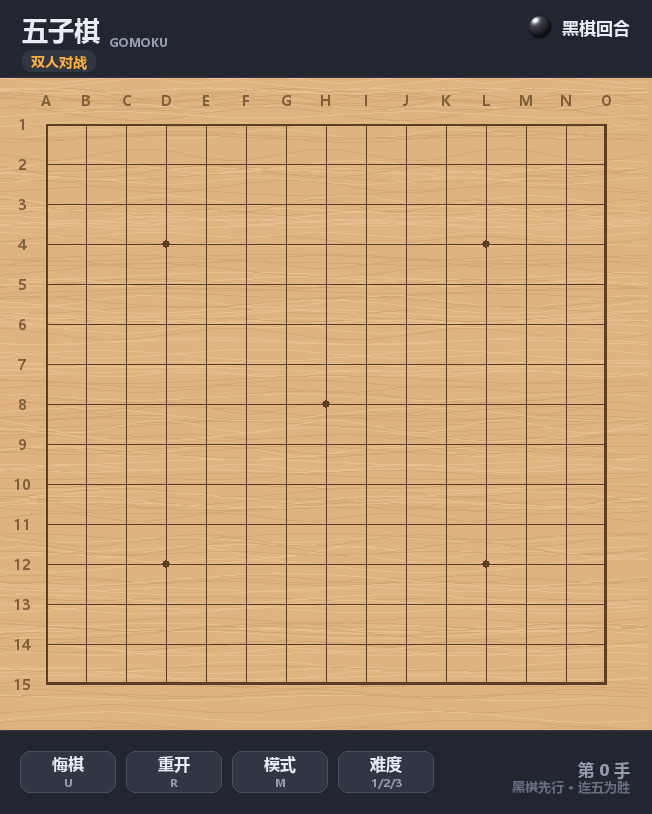
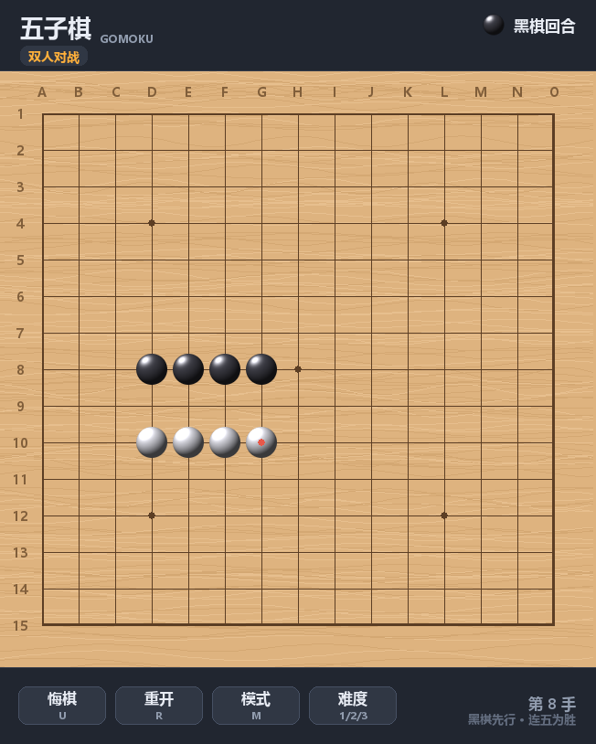
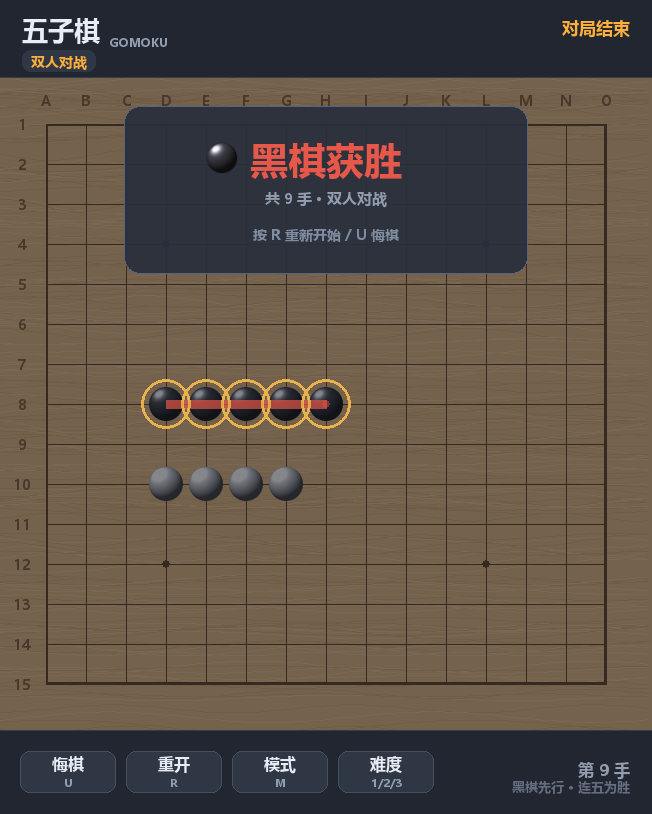

# 五子棋 Gomoku

一个用 pygame 写的五子棋。单文件、**零外部素材** —— 棋盘木纹、立体棋子、音效全部由代码实时生成，clone 下来就能跑。


## 预览

| 开局 | 对局中 | 连五获胜 |
| :---: | :---: | :---: |
|  |  |  |

## 快速开始

```bash
git clone https://github.com/201634924cyh/gomoku.git
cd gomoku
```

然后选一种方式启动：

| 平台 | 命令 |
| --- | --- |
| Windows | 双击 `run.bat` |
| macOS / Linux | `sh run.sh` |
| 任意平台手动 | `pip install -r requirements.txt` 然后 `python gomoku.py` |

启动脚本会自己找 Python、缺 pygame 就自动装（走清华镜像），首次运行不会卡住。

> 没有官方 pygame wheel 的 Python 版本（如 3.14）会自动改装 `pygame-ce` —— 社区分支，API 兼容，装完同样是 `import pygame`。

## 玩法

黑棋先行，横竖斜任意方向先连成五子者获胜。

| 操作 | 说明 |
| --- | --- |
| 鼠标左键 | 落子（悬停时显示半透明预览） |
| `U` / 「悔棋」 | 悔棋；人机模式下一次撤销一整轮 |
| `R` / 「重开」 | 重新开始 |
| `M` / 「模式」 | 切换 人机(你执黑) → 人机(你执白) → 双人对战 |
| `1` `2` `3` / 「难度」 | 切换 AI 难度 简单 / 普通 / 困难 |
| `Esc` | 退出 |

## AI 说明

三档难度的差别在于走法评分与前瞻深度：

| 难度 | 做法 | 单步耗时 |
| --- | --- | --- |
| 简单 | 只看一步棋型分，在靠前的候选里随机挑，会漏威胁 | ~4 ms |
| 普通 | 一步棋型分 + 四三 / 双活三威胁识别 + 攻防权重，能挡活三和冲四 | ~4 ms |
| 困难 | 在普通的基础上，对候选前 6 手各做一层「对手最佳反击」前瞻，扣掉被反杀的价值 | ~14 ms |

棋型评分用长度 9 的窗口沿四个方向扫描，按优先级匹配连五 / 活四 / 冲四 / 活三 / 眠三 / 活二 / 眠二等模式，
并且**要求命中的模式必须覆盖落子点本身** —— 否则会把远处的棋型误算到当前这手上。

实测：困难 AI 对随机手 4:0 全胜，对简单 AI 3:0。

## 自检

```bash
python selftest.py
```

用 `SDL_VIDEODRIVER=dummy` 起虚拟显示，跑 **66 项断言**，覆盖：

- 棋型识别（活三 / 活四 / 冲四 / 连五 / 斜向）
- AI 决策（能赢就赢、必堵冲四、必拆活三、落点合法）
- 状态机（落子 / 悔棋 / 重开 / 换模式 / 键盘边沿触发 / 连五 / 平局 / 重复落子拒绝）
- 渲染像素（棋子明暗、文字不越界、结算面板避让连五线）
- 鼠标事件端到端（`handle_event` → 坐标换算 → 落子 → AI 应手）
- AI 实际对局强度

跑完会在项目根目录留下 `shot_empty.png` / `shot_play.png` / `shot_result.png` 三张截图（已在 `.gitignore` 里）。

游戏本身也支持两个命令行参数，方便脚本化验证：

```bash
python gomoku.py --level 3                 # 启动即用困难难度
python gomoku.py --headless --frames 600   # 虚拟显示跑 600 帧后自动退出
```

## 项目结构

```
gomoku/
├── gomoku.py          # 游戏本体：棋盘渲染、棋子生成、AI、状态机（单文件）
├── selftest.py        # 无窗口自检，66 项断言
├── run.bat            # Windows 启动脚本
├── run.sh             # macOS / Linux 启动脚本
├── requirements.txt   # 依赖（只有 pygame）
├── preview/           # README 用的截图
├── LICENSE
├── .gitignore
└── .gitattributes
```

## 想改造的话，改这几个地方

| 想改什么 | 改哪里 |
| --- | --- |
| 棋盘路数（15 → 19） | `gomoku.py` 顶部的 `N` 常量 |
| 格子大小 / 窗口尺寸 | `CELL`、`MARGIN`（窗口尺寸由它们推导） |
| 配色 | 一组 `C_*` 常量 |
| 棋子大小与质感 | `STONE_R`、`make_stone()` |
| AI 对各棋型的重视程度 | `PATTERNS` 表，以及 `FIVE` / `OPEN_FOUR` / `RUSH_FOUR` / `LIVE_THREE` 等常量 |
| AI 强弱与思考时间 | `ai_choose()`：困难档的候选数（现为 6）与前瞻层数 |
| 音效 | `build_sounds()` 与 `_tone()` |
| 加模式 / 加难度 | `MODES`、`LEVEL_NAMES`、`cycle_mode()`、`cycle_level()` |
| 加黑棋禁手判定 | `place()` 落子前的校验分支 |

## 已知取舍

- **未实现黑棋禁手**（三三 / 四四 / 长连）判定。
- AI 是启发式搜索，不带置换表，极端局面下仍可能走出次优手。
- 渲染完全不用 numpy（棋子用 `Surface.set_at()` 逐像素生成）；numpy 只在合成音效时用到，缺失则整体静默降级，不会崩。
- 窗口尺寸固定，不支持拖拽缩放。

## 许可

[MIT](LICENSE)
